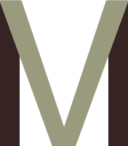

# react-mobx-vm

View & Model are mixed now via react mobx

[](https://travis-ci.org/imcuttle/react-mobx-vm)
[](https://codecov.io/github/imcuttle/react-mobx-vm?branch=master)
[](https://www.npmjs.com/package/react-mobx-vm)
[](https://www.npmjs.com/package/react-mobx-vm)

- UMD `reactMobxVM`
  - https://unpkg.com/react-mobx-vm
  - https://cdn.jsdelivr.net/npm/react-mobx-vm

Note: UMD don't supports extension/Router.

## Examples

```bash
git clone ...
cd react-mobx-vm
npm install
npm run gojs:open -- -i routerV3/browserHistory.js 
```

## Tests
### Units
```bash
npm test
```

### Integration
```bash
npm run test:cy:run
# or 
npm run test:cy:open
```

## Contributing

- The commit message should observe the [rule](http://www.ruanyifeng.com/blog/2016/01/commit_message_change_log.html).
- 
